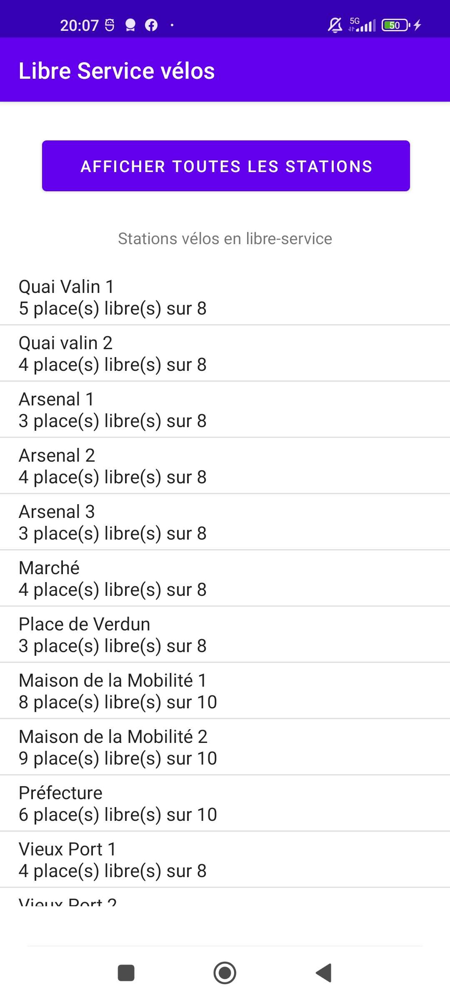
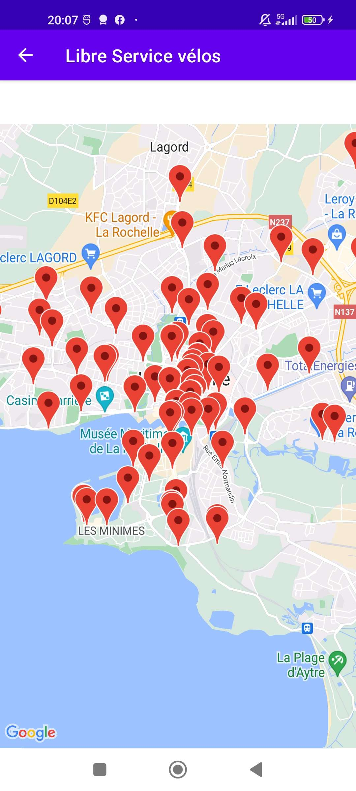
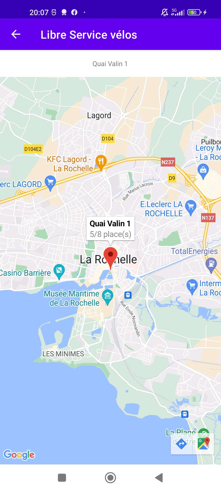

# App Yelo La Rochelle

## Description

Little Kotlin Android app made in class based on the Yelo API (self-service bikes in La Rochelle)
Check the number of bikes available at a choosen station. This choose can be on a map or on a list

## Screenshots 

